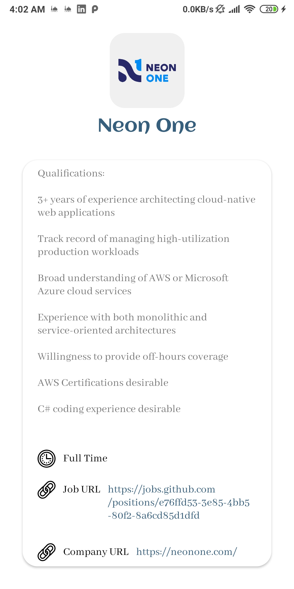

# Jobs-App
A simple job-search app for the Android platform. 
Follows the concept of "Single Activity". 
Architectural pattern (MVVM). 
### Tech used
* Room database
* Data binding
* View binding
* Navigation component
* Safe Args
* RecyclerView and DiffUtil
* Animations
* ViewModels
* LiveData
* kotlin coroutines
* Flow
* Hilt
* Retrofit
* Coil for Image Loading

## Screenshots
<kbd></kbd>
<kbd></kbd>
<kbd></kbd>
<kbd></kbd>

